<div align="center">


<br />


</div>

<table>
<tr>
<td width="39%" valign="top">

### `sevetar@github:~$`

```text
╭─ SYSTEM INFORMATION
│
├─ user    : sevetar
├─ status  : 秋招中...
├─ process : waiting_for_offer.exe
├─ theme   : cyber_neko
└─ power   : code + caffeine

  ฅ( ̳• ·̫ • ̳ฅ)  ONLINE
```

</td>
<td width="61%" align="center" valign="middle">

### `NEKO VISITOR MONITOR`


<sub><code>LIVE</code> · 每一位数字都是主页访问记录 · <code>RULE34 MODE</code></sub>

</td>
</tr>
</table>

<div align="center">

```text
┌─[ cyber_neko@sevetar ]──────────────────────────────────────────────┐
│  connection: secure   signal: strong   mission: capture_an_offer   │
└─────────────────────────────────────────────────────────────────────┘
```



</div>
